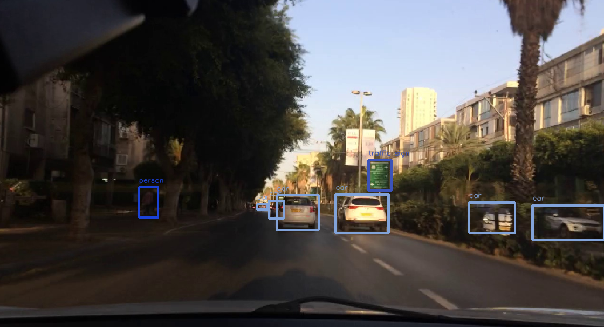

# ROS package for official YOLOv7



This repo contains a ROS noetic package for the official YOLOv7. It wraps the 
[official implementation](https://github.com/WongKinYiu/yolov7) into a ROS node (so most credit 
goes to the YOLOv7 creators).

### Note
There are currently two YOLOv7 variants out there. This repo contains the 
implementation from the paper [YOLOv7: Trainable bag-of-freebies sets new state-of-the-art for real-time object detectors](https://arxiv.org/abs/2207.02696).

## Requirements & Getting Started

Following ROS packages are required:
- [vision_msgs](http://wiki.ros.org/vision_msgs)
- [geometry_msgs](http://wiki.ros.org/geometry_msgs)

First, clone the repo into your catkin workspace and build the package:
```
git clone https://github.com/lukazso/yolov7-ros.git ~/catkin_ws/src/
cd ~/catkin_ws
catkin build yolov7_ros
```

The Python requirements are listed in the `requirements.txt`. You can simply 
install them as
```
pip install -r requirements.txt
```

Download the YOLOv7 weights from the [official repository](https://github.com/WongKinYiu/yolov7).

**Berkeley DeepDrive weights:** I trained YoloV7 with a basic hyperparameter set (no special hyperparameter optimization) on the [Berkeley DeepDrive dataset](https://bdd-data.berkeley.edu/). You can download the weights [here](https://drive.google.com/drive/folders/1OfC1dQx2db0dmmQA15_WScUptbYcfsZ8?usp=sharing).

The package has been tested under Ubuntu 20.04 and Python 3.8.10.

## Usage
Before you launch the node, adjust the parameters in the 
[launch file](launch/yolov7.launch). For example, you need to set the path to your 
YOLOv7 weights and the image topic to which this node should listen to. The launch 
file also contains a description for each parameter.

```
roslaunch yolov7_ros yolov7.launch
```

Each time a new image is received it is then fed into YOLOv7.

## Visualization
You can visualize the yolo results if you set the `visualize` flag in the [launch file](launch/yolov7.launch). Also, with the `classes_path` parameter you can provide a `.txt` file with the class labels. An example file is provided in [berkeley.txt](class_labels/berkeley.txt) or [coco.txt](class_labels/coco.txt).

### Notes
- The detections are published using the [vision_msgs/Detection2DArray](http://docs.ros.org/en/api/vision_msgs/html/msg/Detection2DArray.html) message type.
- The detections will be published under `/yolov7/out_topic`.
- If you set the `visualize` parameter to `true`, the detections will be drawn into 
  the image, which is then published under `/yolov7/out_topic/visualization`.

## Coming Soon
- ROS2 implementation
